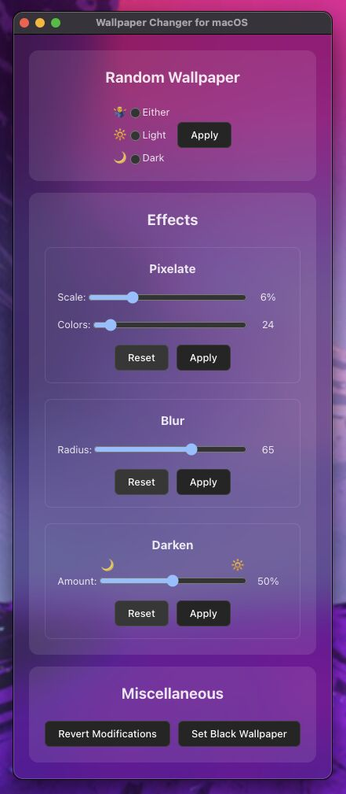

# Wallpaper Changer for macOS

Lightweight app for setting wallpapers on all spaces of all displays.



## Features

- Comfy GUI with adaptive light/dark mode.
- Set a random wallpaper from the dark or light directory, or from either.
- Set a black wallpaper.

**Add effects to the current wallpaper**: 
- Pixelate
- Blur
- Darken
- Undo all effects

## Quick Start

This project currently only works completely in development. In production, the main features (applying/removing various effects) don't yet.

1. **Get a local copy of this project**

Clone this repo by copying the URL here, then running:
```bash
git clone theURL
```

2. **Install the dependencies**

Navigate your terminal to the newly created project directory, then run:
```bash
npm install
```

3. **Run the development build**:

From the project directory, run:
```bash
npm run dev
```
That will build the app in a temporary state, and launch it for immediate use and development (with hot-reloading).

#### 🚨 NOTE:

The app looks for wallpapers in these two directories:

~/Pictures/wallpapers/dark

~/Pictures/wallpapers/light

Support for custom directories and subdirectories is on the roadmap.

## Documentation

This app uses ImageMagick on the backend to manipulate images, and sends the command

`/usr/libexec/PlistBuddy -c "set AllSpacesAndDisplays:Desktop:Content:Choices:0:Files:0:relative file:///${wallpaperPath}" "${plistPath}" && killall WallpaperAgent`

to set the wallpaper on all spaces and displays.

In this MVP, all functionality is contained in the home view component `src/renderer/components/Home.vue` and the main process file `src/main/main.ts`.

## License

This project is licensed under the GPL2 License, with some of the template using the MIT License. See the LICENSE file for details.

## Acknowledgments

- electron-vue-template by Deluze https://github.com/Deluze/electron-vue-template?tab=MIT-1-ov-file
- imagemagick https://imagemagick.org/script/license.php

## Roadmap

**Short term**:
- [x] Get all features (at this point, basically the effects) working in a production build like they do in dev.
- [x] Add buttons to reset the sliders to their default values.
- [ ] Allow the app to run in the menu bar for quick access.
  - [ ] Menu bar item context menu
  - [ ] Automatic cycling on a schedule
- [ ] Option to start app with the system.

**Longer term**:
- [ ] Allow to set a wallpaper by dragging it into the app. (There are simpler and even built-in ways to set a wallpaper, but they don't set it across all spaces on all monitors.)
- [ ] User-specified directories.
  - [ ] Support for subdirectories.
  - [ ] In this case, allow to select multiple directories to find a random wallpaper from.
- [ ] Automatically darken/lighten the wallpaper when the system light/dark state changes.

## Changelog

**0.5** MVP for development environment
